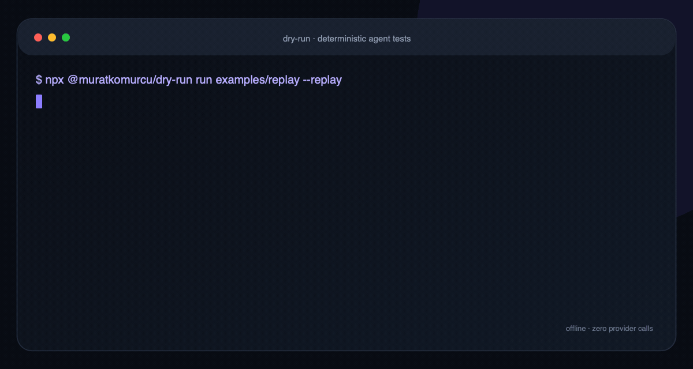

# dry-run

**Deterministic end-to-end testing for AI agents.**
Record once. Replay forever. Ship with confidence.

[](https://www.npmjs.com/package/@muratkomurcu/dry-run)
[](https://github.com/MuratKomurcu1/dry-run/actions)
[](./LICENSE)
[](package.json)

<p align="center">
  
</p>

`dry-run` records provider and optional tool-boundary traffic into reviewable cassettes, then replays the same agent trajectory offline on every commit. It is an E2E regression layer—not a hosted service and not a quality score disguised as a test.

**[Architecture](docs/ARCHITECTURE.md) · [Benchmarks](docs/BENCHMARKS.md) · [Evidence](docs/EVIDENCE.md) · [Security](SECURITY.md) · [Comparison](docs/COMPARISON.md)**

## The problem

Testing AI agents in CI is broken:

- **Live LLM calls are non-deterministic** — the same test passes locally, fails in CI
- **They're slow** — 5–30s per call destroys your feedback loop
- **They're expensive** — a full regression suite can cost more than your API budget

Unit-testing your prompts isn't enough either. Real failures happen in the *trajectory*: the agent calls the wrong tool, forgets to call a guardrail, loops forever.

## The fix: VCR for agents

`dry-run` records your agent's actual LLM traffic into **cassettes**, then replays them deterministically on every CI run — milliseconds, zero dollars, byte-for-byte reproducible.

```
┌─────────┐   record    ┌───────────┐    replay     ┌──────────────┐
│ live run│ ──────────▶ │ cassettes │ ────────────▶ │ every commit │
└─────────┘  (once)     └───────────┘  (free, ms)  └──────────────┘
```

Then assert on what actually matters:

| Assertion | What it catches |
|---|---|
| `toolCalled` / `notToolCalled` | wrong or missing tool usage |
| `argsContains` | wrong arguments to tools |
| `outputContains` / `outputEquals` / `outputMatches` | bad final answers |
| `maxSteps` | runaway loops and step inflation |
| `noRepeatedToolCalls` | agents stuck calling the same tool over and over |
| `maxTokens` | token budget violations |
| `semantic` *(opt-in)* | fuzzy quality via LLM-as-judge |

## Measured replay overhead

The committed implementation check runs 250 fresh single-turn cassette replayers per suite, including disk reads and a deterministic output assertion:

| Measurement | Result |
| --- | ---: |
| 250-scenario in-process median | **2.96 ms** |
| In-process p95 | **3.40 ms** |
| Fresh Node process + real example CLI median | **35.23 ms** |
| Provider network calls / provider cost | **0 / $0** |

These are Apple M5, Node 26.7.0, warm-filesystem microbenchmark results—not a live-provider comparison or universal guarantee. The [methodology, raw samples, limitations, and rerun command](docs/BENCHMARKS.md) are public.

## Quickstart

```bash
npm install --save-dev @muratkomurcu/dry-run
npx @muratkomurcu/dry-run init     # scaffold tests/smoke.agentest.ts
npx @muratkomurcu/dry-run run      # green in milliseconds, offline
```

### The headline: record once, replay forever

Wrap any provider in `autoCassette`:

```ts
import { defineAgent, OpenAIProvider, autoCassette } from "@muratkomurcu/dry-run";

const provider = autoCassette("support-flow", () => new OpenAIProvider({ model: "gpt-4o-mini" }));
```

Then:

```bash
dry-run run             # first run records the cassette (.dryrun/cassettes/support-flow.json)
dry-run run             # every later run replays it — $0, milliseconds, byte-for-byte
dry-run run --replay    # CI mode: never dial out; a stale cassette fails loudly
dry-run run --record    # intentionally re-record
dry-run run --watch     # re-run on every save — TDD for agents
```

**Verified replay.** Replays are matched by conversation *shape* (roles, tool calls, tools, model) — not by exact strings. Reword a prompt and the cassette still works. Change the shape and it fails loudly with a diff instead of silently serving wrong data.

**Secret-shaped values are redacted by default.** Cassettes are filtered before they touch disk (`sk-…`, `Bearer …`, JWTs, AWS keys, and scalar values stored under credential-like keys). Redaction is defense in depth, not a guarantee: review cassettes before committing them and read the [security boundary](SECURITY.md).

Cassettes are plain JSON — review them in PRs next to your prompt changes.

## Slow or flaky tools? Cache them too.

```ts
import { cachedTools } from "@muratkomurcu/dry-run";

execute: (call) => myTools[call.name](call.arguments)
// becomes:
const safeTools = cachedTools({ lookup_order, charge_card });  // recorded & replayed at the tool boundary
```

First run hits the real API; every later run replays recorded results — even for paid third-party APIs.

## Works with Vercel AI SDK

Drop-in model wrapper — test your real `generateText` / `streamText` pipelines offline:

```ts
import { generateText } from "ai";
import { vercelAIModel, MockProvider } from "@muratkomurcu/dry-run";

const { text } = await generateText({
  model: vercelAIModel(myCassetteBackedProvider),
  prompt: "Refund order #1234",
});
```

Write a scenario:

```ts
import { defineAgent, scenario } from "@muratkomurcu/dry-run";

export default [
  scenario({
    name: "support agent refunds correctly",
    agent: mySupportAgent,          // any (input) => Promise<Trajectory>
    input: "I want a refund for order #1234",
    expect: [
      { type: "toolCalled", tool: "lookup_order", argsContains: { id: "1234" } },
      { type: "toolCalled", tool: "issue_refund", times: 1 },
      { type: "notToolCalled", tool: "delete_account" },
      { type: "outputContains", value: "refund" },
      { type: "maxSteps", count: 6 },
    ],
  }),
];
```

Run it:

```
 ✓ support agent refunds correctly (3ms)
     ✓ calls tool "lookup_order"
     ✓ calls tool "issue_refund"
     ✓ never calls tool "delete_account"
     ✓ output contains "refund"
     ✓ uses at most 6 steps

 All 1 scenario(s) passed · 3ms
```

## Works with any agent

Bring your own loop — anything that returns a `{ steps, output }` trajectory works.
Or use the built-in ReAct harness:

```ts
import { defineAgent, OpenAIProvider, AnthropicProvider } from "@muratkomurcu/dry-run";

export const gptAgent = defineAgent({
  provider: new OpenAIProvider({ model: "gpt-4o-mini" }),
  system: "You are a helpful support agent.",
  tools: [lookupOrder, issueRefund],
  execute: (call) => myToolRegistry.run(call),
});

export const claudeAgent = defineAgent({
  provider: new AnthropicProvider({ model: "claude-sonnet-4-5" }),
  system: "You are a helpful support agent.",
  tools: [lookupOrder, issueRefund],
  execute: (call) => myToolRegistry.run(call),
});
```

Native providers ship for **OpenAI** and **Anthropic (Claude)** — and any
OpenAI-compatible endpoint works out of the box, including **Ollama**,
**LiteLLM**, **vLLM**, and **Azure OpenAI** via `OPENAI_BASE_URL`.

## Add to CI

Drop this into your workflow:

```yaml
- uses: MuratKomurcu1/dry-run/.github/actions/dry-run@v0.3.1
  with:
    paths: tests
    mode: replay          # never dial out from CI
    junit-path: report.xml
```

Or roll your own — it's one command:

```yaml
- run: npx @muratkomurcu/dry-run run tests --replay --junit report.xml
```

JUnit XML plugs into GitHub test annotations, GitLab, Jenkins, and everything else.

## Recording cassettes

```ts
import { CassetteStore, recorder, replayer } from "@muratkomurcu/dry-run";

const store = new CassetteStore();

// Record (run locally, once):
await using recorded = recorder(new OpenAIProvider(), store, "support-flow");

// Replay (run in CI):
const agent = defineAgent({ provider: await replayer(store, "support-flow"), ... });
```

## Regression toolkit

**Generate tests from cassettes.** Recorded a run once? Turn it into an editable scenario:

```bash
dry-run generate .dryrun/cassettes/support-refund.json -o tests/refund.agentest.ts
```

The generated file references `autoCassette("support-refund")` — commit both and CI replays real model traffic offline, with assertions pre-filled from what actually happened.

**Diff two cassettes.** Did this prompt change actually change behavior?

```bash
$ dry-run diff .dryrun/cassettes/v1.json .dryrun/cassettes/v2.json
 1 drift(s) detected
   OUTPUT "Your refund for order #1234 has been processed."
      → "Your refund has been escalated to a manager."
```

Exit code `1` on drift — drop it straight into CI.

**Golden baselines.** Lock in current behavior across all scenarios, then fail on any deviation:

```bash
dry-run golden save baseline     # snapshot tool paths + outputs
dry-run golden check baseline    # exit 1 if anything drifted
```

**HTML trajectory reports.** Every step your agent took, visualized:

```bash
dry-run run tests --replay --html report.html   # self-contained file, dark mode, zero JS deps
```

With a golden baseline present, each scenario shows its drift status inline.

## Why not promptfoo / deepeval?

Those are great **eval** tools. `dry-run` is an **E2E test** tool — closer to Playwright than to a benchmark:

| | Eval frameworks | dry-run |
|---|---|---|
| Deterministic in CI | ✗ (live model variance) | ✓ (cassette replay) |
| Cost per run | $$ per case | $0 |
| Speed | seconds–minutes | **milliseconds** |
| Asserts on trajectories | limited | first-class |
| Loop / budget detection | rare | `noRepeatedToolCalls`, `maxTokens` |
| Stale cassette detection | — | shape-signature fails loudly |
| Test generation from runs | — | `generate` |
| Golden-set regression gates | — | `golden save/check` + `diff` |
| Trajectory visualization | cloud dashboards | self-contained HTML report |
| Fails like a unit test | report-style | exit code + assertion diff + JUnit |

See [Where dry-run fits](docs/COMPARISON.md) for the non-marketing version: when to use an eval framework, an observability platform, a browser E2E tool, or dry-run together.

## Roadmap

- [ ] Python SDK (`pip install dry-run`)
- [ ] LangGraph.js / Claude Agent SDK adapters
- [ ] Streaming + MCP tool-call recording

Contributions welcome! See [CONTRIBUTING.md](CONTRIBUTING.md).

Release history and the reproducible release gate live in [CHANGELOG.md](CHANGELOG.md) and [docs/RELEASE.md](docs/RELEASE.md).

## Configuration

Optional `dryrun.config.json` at your repo root:

```json
{
  "include": ["tests"],
  "mode": "auto",
  "junitPath": "report.xml",
  "judge": { "provider": "anthropic", "model": "claude-sonnet-4-5" }
}
```

CLI flags override config values.

## License

[MIT](./LICENSE)
